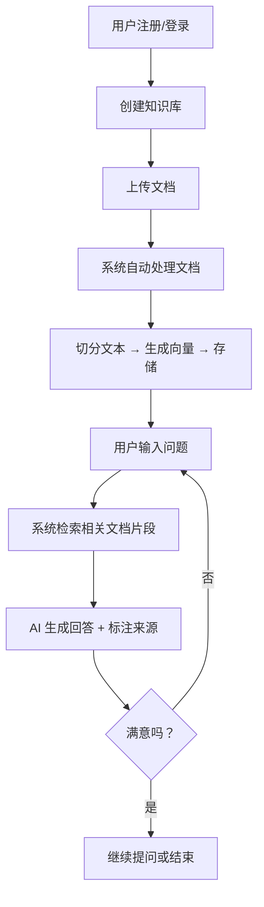

# AI 知识库问答系统 — 产品需求文档（PRD）

## 1. 产品概述

### 1.1 产品名称
SmartDoc AI（智能文档问答系统）

### 1.2 一句话描述
用户上传文档（PDF、Word、TXT、网页链接），系统自动构建知识库，用户可以用自然语言提问，AI 基于文档内容给出精准回答并标注来源。

### 1.3 目标用户
- 需要快速检索大量文档的职场人士
- 需要整理学习资料的学生/研究人员
- 需要搭建内部知识库的小团队
- 需要智能客服能力的小企业主

### 1.4 核心价值
- **节省时间**：不用一页页翻文档，秒级获得答案
- **精准引用**：每个回答都标注来自哪个文档、哪一页
- **零门槛**：上传文档即可使用，无需技术背景

---

## 2. 功能需求

### 2.1 核心功能（MVP — 第一版必须有）

| 功能 | 描述 | 优先级 |
|------|------|--------|
| 用户注册/登录 | 邮箱注册、密码登录 | P0 |
| 文档上传 | 支持 PDF、TXT、Markdown 格式 | P0 |
| 知识库管理 | 创建、删除、重命名知识库 | P0 |
| 文档向量化 | 上传后自动切分、向量化并存储 | P0 |
| 智能问答 | 基于知识库内容回答问题，标注来源 | P0 |
| 对话历史 | 保存每次对话记录 | P1 |

### 2.2 增强功能（第二版再加）

| 功能 | 描述 | 优先级 |
|------|------|--------|
| Word 文档支持 | .docx 格式解析 | P1 |
| 网页链接导入 | 输入 URL 自动抓取内容 | P1 |
| 多知识库联合检索 | 跨知识库搜索相关内容 | P2 |
| 分享知识库 | 生成分享链接，他人可查看/提问 | P2 |
| 流式输出 | AI 回答逐字显示，提升体验 | P1 |
| 深色模式 | UI 深色主题 | P2 |

### 2.3 未来功能（第三版及以后）

| 功能 | 描述 |
|------|------|
| 团队协作 | 多人共享、权限管理 |
| API 接口 | 提供第三方调用接口 |
| OCR 支持 | 扫描件 PDF 文字识别 |
| 多语言 | 英文界面 + 多语言问答 |

---

## 3. 用户流程

### 3.1 核心用户旅程

### 3.2 页面列表

1. **登录/注册页** — 邮箱 + 密码
2. **仪表盘（Dashboard）** — 知识库列表、最近对话
3. **知识库详情页** — 文档列表、上传入口
4. **对话页** — 核心问答界面，左侧知识库选择，右侧对话
5. **设置页** — 个人信息、API Key 配置

---

## 4. 非功能需求

| 需求 | 指标 |
|------|------|
| 响应时间 | 问答响应 < 5 秒 |
| 文档处理 | 单文件 < 50MB，处理时间 < 2 分钟 |
| 并发 | 支持 50 人同时使用 |
| 可用性 | 99.5% 在线率 |
| 安全 | 密码加密、数据隔离 |

---

## 5. 技术约束

- 用户需自行配置 AI 模型的 API Key（支持 OpenAI / DeepSeek / 智谱等）
- MVP 阶段不需要分布式部署，单机即可
- 优先使用免费/开源方案降低成本

---

## 6. 成功指标

| 指标 | 目标 |
|------|------|
| MVP 上线时间 | 4-6 周（跟随 AI 步调） |
| 问答准确率 | > 85% 用户满意 |
| 文档处理成功率 | > 95% |
| 用户留存 | 次日 > 40% |
